  
  
  
  

## Featured Projects

  
  
  
  

## Stack

 

## Activity

  
  
   
  

  <picture>
    <source media="(prefers-color-scheme: dark)" srcset="https://raw.githubusercontent.com/asayed18/asayed18/output/github-snake-dark.svg" />
    <source media="(prefers-color-scheme: light)" srcset="https://raw.githubusercontent.com/asayed18/asayed18/output/github-snake.svg" />
    
  </picture>

## Certifications

- **Scrum Certified Developer**
- **Deep Learning Nanodegree** from Udacity
- **Full-Stack Web Development Nanodegree** from Udacity

Outside work: hiking and trying new cuisines.

